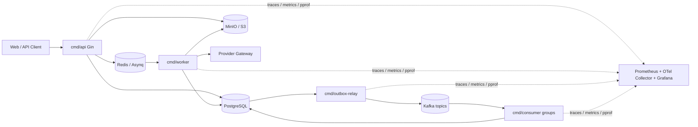

# OpenStory

> 开源自托管 AI 视频创作工作流平台 — 输入创意，生成剧本、角色、分镜、图片/视频，合成 15-30 秒预览视频。

## 架构

```
cmd/
  api/            HTTP API 服务器 (Gin)
  worker/         Asynq 异步任务 worker
  outbox-relay/   Outbox → Kafka 事件中继
  consumer/       Kafka 事件消费者

internal/
  config/         环境变量配置
  observability/  zerolog、OpenTelemetry、Prometheus、pprof
  db/             PostgreSQL 连接池 (pgx)
  http/           Gin 路由、中间件、Handler
  auth/           认证授权 (TODO)
  project/        项目管理 (TODO)
  workflow/       工作流 DAG 编排 (TODO)
  task/           Asynq 生成任务执行
  asset/          MinIO/S3 素材元数据、预签名上传、对象存储
  provider/       Provider 抽象、结构化 JSON、调用日志
  eventbus/       EventBus 接口、OutboxWriter、KafkaEventBus
  outbox/         Outbox Relay + Prometheus 指标
  consumer/       Consumer group、幂等消费、DLQ、消费指标
  billing/        积分流水与 credit.events
  moderation/     内容审核和管理员审核
```



## 技术栈

| 组件 | 技术 |
|---|---|
| 语言 | Go 1.26 |
| HTTP | Gin |
| 数据库 | PostgreSQL 17 (pgx) |
| 缓存 | Redis 8 |
| 消息队列 | Apache Kafka 4.2.0 |
| 对象存储 | MinIO |
| 日志 | zerolog |
| 迁移 | goose |
| 指标 | Prometheus client |
| 容器化 | Docker Compose |

## 数据库 Schema

基础 schema 包含 16 张业务表，消费者迁移额外维护幂等表、失败表和读模型表：

| 分类 | 表名 | 说明 |
|---|---|---|
| 用户 | `users` | 用户账户，支持 admin/user 角色 |
| 用户 | `refresh_tokens` | JWT 刷新令牌 |
| 项目 | `projects` | 视频创作项目 |
| 项目 | `works` | 最终产出作品 |
| 项目 | `assets` | MinIO 媒体资源 |
| 工作流 | `workflows` | DAG 工作流定义 |
| 工作流 | `workflow_nodes` | DAG 节点 |
| 工作流 | `workflow_edges` | DAG 边 |
| 工作流 | `workflow_versions` | 工作流版本快照 |
| 任务 | `generation_tasks` | AI 生成任务 (幂等键) |
| 任务 | `task_events` | 任务状态变更事件 |
| 事件 | `outbox_events` | 事务性 Outbox (BIGSERIAL) |
| 计费 | `credit_accounts` | 积分账户 (CHECK >= 0) |
| 计费 | `credit_ledger` | 积分流水 |
| 审核 | `moderation_records` | 内容审核记录 |
| 审计 | `audit_logs` | 操作审计日志 |
| 消费 | `consumer_processed_events` | 消费者幂等记录 |
| 消费 | `consumer_failures` | 消费失败次数和错误 |
| 分析 | `analytics_task_metrics` | 任务成功率、耗时、成本聚合 |
| 通知 | `notifications` | 任务完成通知 |
| Feed | `feed_items` | 作品发布 feed 索引 |
| Provider | `provider_configs` | 加密 provider 配置 |
| Provider | `provider_call_logs` | provider 耗时、错误、成本记录 |

**Seed 数据**: admin 用户 (10000 积分) + demo 用户 (500 积分) + 示例项目

## 事件总线与 Outbox

业务代码只依赖 `eventbus.EventBus`，默认实现是 `OutboxWriter`，所有业务事件先写入 `outbox_events`。`cmd/outbox-relay` 轮询未发布事件，投递到 Kafka 后写入 `published_at`；失败时递增 `retry_count` 并记录 `last_error`，下轮继续重试。

事件 envelope 字段：

```json
{
  "event_id": "uuid",
  "event_type": "task_created",
  "aggregate_type": "generation_task",
  "aggregate_id": "uuid",
  "user_id": "uuid",
  "request_id": "optional",
  "traceparent": "optional W3C trace context",
  "trace_id": "optional",
  "schema_version": 1,
  "occurred_at": "RFC3339 timestamp",
  "payload": {}
}
```

Kafka topics：

| Topic | 用途 |
|---|---|
| `generation.task.events` | 任务创建、排队、运行、成功、失败、取消、重试 |
| `asset.events` | 素材创建 |
| `work.events` | 作品发布 |
| `credit.events` | 积分扣减/流水 |
| `moderation.events` | 内容审核 |
| `audit.events` | 审计事件 |
| `notification.events` | 通知事件 |
| `openstory.dlq` | 消费失败死信队列 |

Outbox Relay 指标暴露在 `http://localhost:19090/metrics`：

| Metric | 说明 |
|---|---|
| `openstory_outbox_backlog_total` | 未发布 outbox 事件数量 |
| `openstory_outbox_failures_total` | Kafka 投递失败次数 |
| `openstory_outbox_publish_duration_seconds` | Kafka 投递耗时 |

## Kafka Consumers

`cmd/consumer` 通过 `CONSUMER_NAME` 启动不同消费者，每个消费者使用独立 consumer group。消费流程是 at-least-once：先 `FetchMessage`，在 DB 事务内插入 `consumer_processed_events` 幂等记录并执行 handler，事务成功后再提交 Kafka offset。处理失败时写入 `consumer_failures`，投递 `openstory.dlq` 成功后提交源消息，避免毒消息阻塞分区。

| Consumer | Topic | Side effect |
|---|---|---|
| `analytics-consumer` | `generation.task.events` | 聚合任务成功率、平均耗时、模型成本 |
| `notification-consumer` | `generation.task.events` | 任务终态后写 `notifications` |
| `feed-consumer` | `work.events` | 作品发布后 upsert `feed_items` |
| `moderation-consumer` | `work.events` | 作品发布后写入 `moderation_records` 待审核 |
| `audit-consumer` | `audit.events` | 审计事件落库到 `audit_logs` |

消费者指标：

| Metric | 说明 |
|---|---|
| `openstory_consumer_kafka_lag` | 按 consumer/topic/partition 暴露 Kafka lag |
| `openstory_consumer_consume_duration_seconds` | 消费处理耗时 |
| `openstory_consumer_failures_total` | 消费失败次数 |
| `openstory_consumer_failure_rate` | 进程启动后的消费失败率 |

## 观测

所有进程都会暴露 Prometheus metrics 和 pprof。API 请求会生成或透传 `X-Request-ID`，并通过 W3C `traceparent` 贯穿 API、Asynq worker、Outbox、Kafka consumer。日志、outbox envelope、Kafka headers 都包含 `request_id` / `trace_id`。

| 进程 | Metrics / pprof |
|---|---|
| API | `http://localhost:19094/metrics`, `http://localhost:19094/debug/pprof/` |
| Worker | `http://localhost:19095/metrics`, `http://localhost:19095/debug/pprof/` |
| Outbox Relay | `http://localhost:19090/metrics`, `http://localhost:19090/debug/pprof/` |
| Analytics Consumer | `http://localhost:19091/metrics`, `http://localhost:19091/debug/pprof/` |
| Notification Consumer | `http://localhost:19096/metrics`, `http://localhost:19096/debug/pprof/` |
| Feed Consumer | `http://localhost:19097/metrics`, `http://localhost:19097/debug/pprof/` |
| Moderation Consumer | `http://localhost:19098/metrics`, `http://localhost:19098/debug/pprof/` |
| Audit Consumer | `http://localhost:19099/metrics`, `http://localhost:19099/debug/pprof/` |

核心指标：

| Metric | 说明 |
|---|---|
| `openstory_api_request_duration_seconds` | API 延迟 |
| `openstory_task_success_rate` | 任务成功率 |
| `openstory_task_duration_seconds` | 任务耗时 |
| `openstory_queue_backlog_total` | Asynq 队列积压 |
| `openstory_consumer_kafka_lag` | Kafka lag |
| `openstory_provider_error_rate` | Provider 错误率 |
| `openstory_ffmpeg_duration_seconds` | FFmpeg 耗时 |
| `openstory_billing_failure_rate` | 积分扣费失败率 |

OpenTelemetry 默认关闭。启用后进程会通过 OTLP/HTTP 上报 trace：

```bash
OTEL_TRACES_ENABLED=true
OTEL_EXPORTER_OTLP_ENDPOINT=localhost:4318
OTEL_SERVICE_NAME=openstory
```

Grafana dashboard 位于 `observability/grafana/openstory-dashboard.json`。

## Provider Gateway

Provider 层不绑定单一模型，worker 只通过能力接口调用：

| 能力 | 接口 | 状态 |
|---|---|---|
| TextGenerate | `TextGenerator` | Mock + OpenAI-compatible |
| ImageGenerate | `ImageGenerator` | Mock + ComfyUI/Replicate adapter skeleton |
| VideoGenerate | `VideoGenerator` | Mock + ComfyUI/Replicate adapter skeleton |
| Embedding | `EmbeddingGenerator` | 接口预留 |

已实现 provider：

| Provider | 名称 | 说明 |
|---|---|---|
| Mock | `mock` | 本地结构化输出，覆盖创意到分镜闭环和图片/视频 mock |
| OpenAI-compatible | `openai-compatible` | `/chat/completions` 文本生成，使用 `response_format=json_schema` |
| ComfyUI | `comfyui` | `/prompt` adapter 骨架 |
| Replicate | `replicate` | `/predictions` adapter 骨架 |

文本生成阶段强制结构化 JSON，并使用 JSON Schema 校验。Schema 校验失败会按 `PROVIDER_MAX_ATTEMPTS` 重试；仍失败时降级为本地结构化 fallback，避免任务输出变成不可解析文本。当前闭环支持：

```text
idea -> script -> characters -> storyboard -> image prompts -> video prompts
```

API key 只能从环境变量或 `provider_configs` 加密配置读取，不能写死在代码里。数据库配置使用 AES-GCM 加密，解密密钥来自 `PROVIDER_CONFIG_ENCRYPTION_KEY`。

Provider 相关环境变量：

```bash
PROVIDER_MAX_ATTEMPTS=2
PROVIDER_CONFIG_ENCRYPTION_KEY=
OPENAI_COMPATIBLE_BASE_URL=https://api.openai.com/v1
OPENAI_COMPATIBLE_MODEL=gpt-4o-mini
OPENAI_COMPATIBLE_API_KEY=
COMFYUI_BASE_URL=
COMFYUI_API_KEY=
REPLICATE_BASE_URL=https://api.replicate.com/v1
REPLICATE_API_TOKEN=
```

## 产品能力

积分系统支持余额查询、任务开始前预扣、成功确认扣费、失败或取消退款。`credit_accounts` 和 `credit_ledger` 在同一事务内更新，`credit_ledger` 对 `reference_type + reference_id + type` 建唯一索引，重复 worker 执行或重复回调不会重复扣费。

API 层支持 Redis 固定窗口限流：IP 级 `RATE_LIMIT_IP_PER_MINUTE`、用户级 `RATE_LIMIT_USER_PER_MINUTE`，生成任务创建前会检查 `TASK_CONCURRENT_LIMIT` 用户并发任务数。敏感写操作会落 `audit_logs`。

作品发布先进入审核队列，`moderation_records.status` 只允许 `pending`、`approved`、`rejected`。管理员审核通过后才将作品置为 `published` 并发布 `work_published` 事件，审核拒绝会将作品置为 `rejected`。

## 素材与合成

素材元数据落库到 `assets`，对象文件存储在 MinIO/S3。素材记录包含 `mime_type`、`size_bytes`、`duration_ms`、`width`、`height`、`checksum`、`storage_bucket`、`storage_key` 等字段。

上传流程先调用 `POST /api/assets/upload-url` 创建素材占位记录并返回 15 分钟有效的 PUT 预签名 URL。合成流程通过 `POST /api/projects/:id/compose` 创建 `compose` 类型任务，由 worker 使用 FFmpeg 下载多张图片、生成 MP4、抽取封面，并可上传 SRT/VTT 字幕占位文件。合成产物会写入视频、封面、字幕素材记录，并通过 outbox 写入 `asset.events` / `asset_created` 和 `generation.task.events` / `task_succeeded`。

## 快速开始

### 前置条件

- Go 1.26+
- Docker & Docker Compose
- (可选) goose, golangci-lint

### 启动所有服务

```bash
# 复制环境变量
cp .env.example .env

# 启动所有服务 (PostgreSQL, Redis, Kafka, MinIO, API, Worker, Outbox Relay, Consumers)
make dev

# 或只启动基础设施，本地运行 API
make dev-infra
make migrate
go run ./cmd/api
```

本地常用登录账号：

| 用户 | 邮箱 | 密码 |
|---|---|---|
| Admin | `admin@openstory.local` | `changeme123` |
| Demo | `demo@openstory.local` | `demo123456` |

本地开发建议流程：

```bash
make dev-infra
make migrate
go run ./cmd/api
go run ./cmd/worker
go run ./cmd/outbox-relay
CONSUMER_NAME=analytics-consumer go run ./cmd/consumer
```

如需同时本地启动多个 Go 进程，给每个进程设置不同 `OBSERVABILITY_ADDR`，避免诊断端口冲突。

### 验证

```bash
# 健康检查
curl http://localhost:18080/healthz

# 深度就绪检查
curl http://localhost:18080/readyz
```

### 常用命令

```bash
make help          # 查看所有命令
make dev           # 启动所有服务
make stop          # 停止所有服务
make test          # 运行测试
make lint          # 代码检查
make migrate       # 数据库迁移
make build         # 构建二进制
```

## 生产部署

### 架构

```
                    ┌─────────────────────┐
                    │   CloudFlare CDN    │
                    │   (incipe.top)      │
                    └─────────┬───────────┘
                              │ HTTPS :2053
                              ▼
              ┌───────────────────────────────┐
              │  Nginx (80/443/2053)          │
              │  ├─ /            → frontend   │
              │  ├─ /api/*       → api        │
              │  ├─ /openstory/* → minio      │
              │  └─ HTTP → HTTPS redirect     │
              └──────────────┬────────────────┘
                             │  Docker Network
        ┌────────────────────┼────────────────────┐
        │                    │                    │
   ┌────▼─────┐  ┌──────────▼──┐  ┌──────────────▼──┐
   │ Frontend │  │  API (Gin)  │  │ Worker (Asynq)  │
   │ :3000    │  │  :8080      │  │                 │
   └──────────┘  └──────┬──────┘  └────────┬────────┘
                        │                  │
          ┌─────────────┼──────────────────┼─────────────┐
          │             │                  │             │
     ┌────▼───┐  ┌──────▼──┐  ┌─────────▼┐  ┌─────────▼──┐
     │Postgres│  │  Redis  │  │  Kafka   │  │   MinIO    │
     │ :5432  │  │  :6379  │  │  :9092   │  │   :9000    │
     └────────┘  └─────────┘  └────┬─────┘  └────────────┘
                                   │
                    ┌──────────────┼──────────────┐
                    │              │              │
               ┌────▼───┐  ┌──────▼──┐  ┌───────▼──────┐
               │Outbox  │  │Consumer │  │Consumer ×4   │
               │Relay   │  │Analytics│  │notification  │
               │        │  │         │  │feed/mod/audit│
               └────────┘  └─────────┘  └──────────────┘
```

### 快速部署

```bash
# 1. 配置环境变量
cp .env.production .env
# 编辑 .env，设置 MINIO_PUBLIC_ENDPOINT=https://你的域名

# 2. 构建并启动所有服务
./deploy.sh

# 或分步操作
docker compose -f docker-compose.prod.yml build --parallel
docker compose -f docker-compose.prod.yml up -d
```

### HTTPS 与证书

默认使用自签名证书。获取 Let's Encrypt 正式证书（需要域名已解析到服务器）：

```bash
certbot certonly --webroot -w /var/www/certbot -d incipe.top
# 将证书复制到 nginx/certs/ 后重建 nginx
docker compose -f docker-compose.prod.yml build nginx
docker compose -f docker-compose.prod.yml up -d
```

**CloudFlare + 非标端口：** 如果 443 被限制，可使用 2053 端口（CloudFlare 支持的 HTTPS 源站端口）。在 CloudFlare 后台将源站端口设为 2053，SSL 模式设为 Full。

### 部署命令

```bash
./deploy.sh              # 完整部署（检查 → 构建 → 启动）
./deploy.sh status       # 查看所有服务状态
./deploy.sh logs [svc]   # 查看日志
./deploy.sh restart api  # 重启指定服务
./deploy.sh stop         # 停止所有服务
./deploy.sh migrate      # 手动执行数据库迁移

# 备份
./scripts/backup.sh db    # 备份数据库
./scripts/backup.sh full  # 完整备份（含 MinIO）
```

### 生产端口

| 端口 | 用途 | 公网 |
|------|------|------|
| 80 | HTTP → HTTPS 重定向 | ✅ |
| 443 | HTTPS | ✅ |
| 2053 | HTTPS（CloudFlare 源站） | ✅ |
| 9000 | MinIO API（可关闭） | ⚠️ 可选 |

其他服务端口仅 Docker 内网可见。

### 容器资源限制

适配 2C/2G 服务器，总计约 2.3GB：

| 服务 | 内存 | CPU |
|------|------|-----|
| nginx | 64M | 0.25 |
| frontend | 256M | 0.5 |
| api | 256M | 0.5 |
| worker | 256M | 0.5 |
| postgres | 256M | 0.5 |
| kafka | 768M | 1.0 |
| redis | 128M | 0.25 |
| minio | 256M | 0.5 |
| outbox-relay | 64M | 0.25 |
| consumer ×5 | 64M each | 0.25 each |

## API 端点

| Method | Path | Auth | 描述 |
|---|---|---|---|
| GET | `/healthz` | — | 存活探针 |
| GET | `/readyz` | — | 就绪探针 (检查 DB + Redis) |
| POST | `/api/auth/register` | — | 注册新用户 |
| POST | `/api/auth/login` | — | 登录 (返回 JWT access + refresh token) |
| POST | `/api/auth/refresh` | — | 刷新 token |
| GET | `/api/me` | ✅ | 当前用户信息 |
| GET | `/api/credits/balance` | ✅ | 查询积分余额 |
| POST | `/api/projects` | ✅ | 创建项目 |
| GET | `/api/projects` | ✅ | 项目列表 (分页) |
| GET | `/api/projects/:id` | ✅ | 项目详情 |
| PATCH | `/api/projects/:id` | ✅ | 更新项目 |
| POST | `/api/projects/:id/workflows` | ✅ | 创建工作流 |
| GET | `/api/workflows/:id` | ✅ | 获取工作流 (含节点和边) |
| PUT | `/api/workflows/:id` | ✅ | 更新工作流 (DAG 校验) |
| POST | `/api/workflows/:id/validate` | ✅ | 验证 DAG + 拓扑排序 |
| POST | `/api/workflows/:id/snapshot` | ✅ | 创建版本快照 |
| POST | `/api/generation/tasks` | ✅ | 创建生成任务 (Asynq) |
| GET | `/api/generation/tasks/:id` | ✅ | 任务详情 |
| POST | `/api/generation/tasks/:id/cancel` | ✅ | 取消任务 |
| GET | `/api/generation/tasks/:id/events` | ✅ | 任务状态事件 |
| GET | `/api/projects/:id/tasks` | ✅ | 项目任务列表 (分页) |
| POST | `/api/assets/upload-url` | ✅ | 创建素材记录并返回 MinIO/S3 预签名上传 URL |
| GET | `/api/assets/:id` | ✅ | 获取素材详情 |
| GET | `/api/projects/:id/assets` | ✅ | 获取项目素材列表 |
| POST | `/api/projects/:id/compose` | ✅ | 创建 FFmpeg 多图片合成 MP4 任务 |
| GET | `/api/compose/:taskId` | ✅ | 获取合成任务状态和输出 |
| POST | `/api/works/:id/publish` | ✅ | 提交作品进入审核 |
| GET | `/api/admin/moderation` | ✅ admin | 审核记录列表 |
| POST | `/api/admin/works/:id/review` | ✅ admin | 管理员审核作品 |
| GET | `/api/feed` | — | 公开动态流 (分页) |

## 端口映射

### 开发环境

| 服务 | 端口 |
|---|---|
| Nginx (生产) | `80`, `443`, `2053` |
| API | `18080` |
| API Metrics / pprof | `19094` |
| Worker Metrics / pprof | `19095` |
| PostgreSQL | `15432` |
| Redis | `16379` |
| Kafka | `19092` |
| Outbox Relay Metrics / pprof | `19090` |
| Analytics Consumer Metrics / pprof | `19091` |
| Notification Consumer Metrics / pprof | `19096` |
| Feed Consumer Metrics / pprof | `19097` |
| Moderation Consumer Metrics / pprof | `19098` |
| Audit Consumer Metrics / pprof | `19099` |
| MinIO API | `19000` |
| MinIO Console | `19001` |

### 生产环境

| 服务 | 端口 | 说明 |
|---|---|---|
| Nginx | `80` → HTTPS 重定向 | 公网 |
| Nginx | `443` / `2053` HTTPS | 公网 |
| MinIO API | `9000` | 公网（presigned URL） |
| MinIO Console | `9001` | 仅 localhost |
| 其他服务 | Docker 内网 | 不对外暴露 |

## License

MIT
